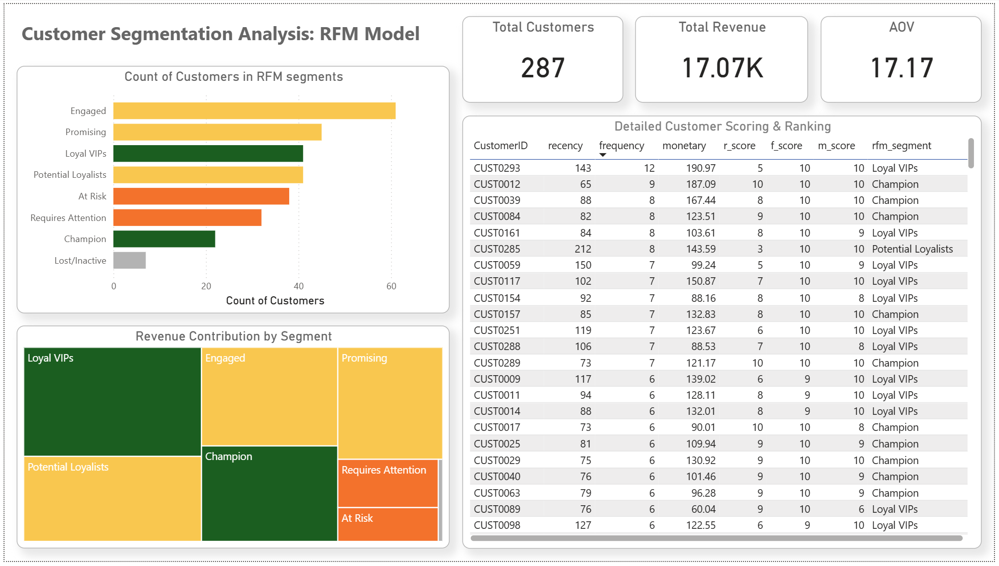

# Customer Segmentation Analysis: RFM Model
> **End-to-End BI Solution: Google BigQuery (SQL) & Power BI**

## Project Overview
This project presents an end-to-end analytical solution designed to segment a customer base using the **RFM (Recency, Frequency, Monetary)** model. The goal was to transform over 12 months of raw sales data into actionable business insights to identify loyal VIPs, potential growth segments, and customers at risk of churn.

The project utilizes a modern data stack, connecting **Google BigQuery** for cloud data warehousing and **Power BI** for advanced visualization.

---

## Tech Stack
Category Tools & Technologies 

**Data Warehouse:** Google Cloud Platform (BigQuery) 
**SQL Dialect:**  Standard SQL 
**BI Tool:** Power BI Desktop 
**SQL Concepts:**  Layered Views, CTEs, Window Functions (`ROW_NUMBER`, `NTILE`), `UNION ALL`, `CASE WHEN` 
**Power BI Concepts:**  DAX, Data Modeling, UI/UX Design, Semantic Color Grouping 

---

## Data Architecture & SQL Logic
The data processing pipeline was built using a **layered view architecture** in BigQuery to ensure modularity and scalability:

*   **Data Integration:** Merged 12 monthly sales tables into a single consolidated table (`sales_2025`) using `UNION ALL`.
*   **RFM Metrics:** Calculated core metrics for each customer:
    *   **Recency:** Days since the last purchase using `DATE_DIFF`.
    *   **Frequency:** Total count of orders per customer.
    *   **Monetary:** Total spending (`SUM`) per customer.
*   **Scoring (Deciles):** Utilized `NTILE(10)` to assign scores from 1 to 10 for each metric, creating a granular ranking system.
*   **Final Segmentation:** Applied complex `CASE WHEN` logic to group customers into 8 strategic business segments based on their total RFM score.

> 🔗 **[View the full SQL script here](rfm_analysis.sql)**

---

## Dashboard & Insights
The Power BI dashboard was designed with a focus on **Strategic UI/UX** to drive business decision-making:

### Key Components:
*   **KPI Cards:** High-level overview of Total Customers (287), Total Revenue ($17.07K), and Average Order Value (AOV).
*   **Customer Distribution (Bar Chart):** Visualizes the count of customers across segments.
*   **Revenue Contribution (Treemap):** Highlights which segments generate the actual value.
*   **Customer Value Matrix (Scatter Chart):** A granular view of all 287 customers, plotting Frequency vs. Monetary to identify outliers and high-value clusters.

### Semantic Color Grouping:
To improve readability and focus on business action, I implemented a 4-color grouping strategy:
*   🟢 **Green (Success):** Champions & Loyal VIPs – The core of the business.
*   🟡 **Yellow (Growth Potential):** Engaged, Promising & Potential Loyalists – High potential for conversion to VIP.
*   🟠 **Orange (Risk):** Customers requiring attention or at risk of churning.
*   ⚫ **Gray (Inactive):** Lost or inactive customers.

---

## Key Business Insights
*   **The "Yellow" Opportunity:** While "Champions" are the most loyal, the **"Engaged" and "Promising" segments** (Yellow) represent the largest portion of the customer base and total revenue. Converting these customers to "Loyal VIPs" is the highest growth opportunity.
*   **Retention Alert:** The **"At Risk"** group is significantly larger than the "Champions" group, indicating a need for immediate re-engagement strategies to prevent further churn.
---

## Data Source & Acknowledgements
*   **Data Source:** This project uses a synthetic e-commerce dataset representing 12 months of sales transactions.
*   **Inspiration:** This project was inspired by the roadmap provided by **Mo Chen** in the *"SQL & Power BI Data Analyst Portfolio Project"*. 
*   **Personal Contribution:** While following the educational path, I independently implemented the data pipeline in **Google Cloud Platform**, resolved regional connectivity issues between BigQuery and Power BI, and customized the visualization layer with advanced charts (Treemap, Scatter) and a custom UI/UX color strategy.

---

## Contact
**Patryk Konarzewski**
www.linkedin.com/in/patryk-konarzewski-data | konarzewski.pat@gmail.com
